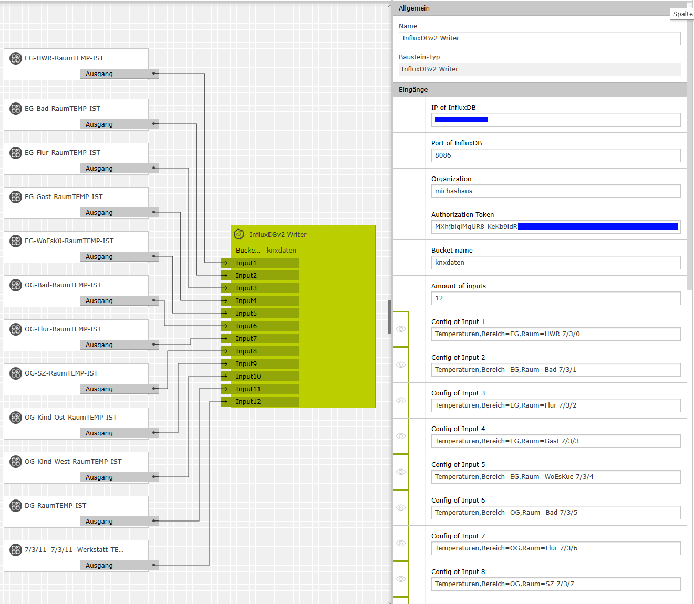
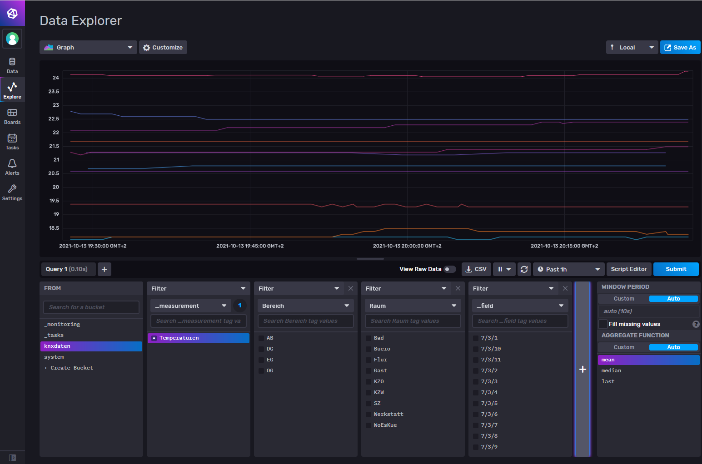

# InfluxDBv2Writer_GiraX1
Logic node for writing time series data to [InfluxDB v2.0](https://docs.influxdata.com/influxdb/v2.0/) via [HTTP REST API v2.0](https://docs.influxdata.com/influxdb/v2.0/reference/api/). This logic node can be used with [Gira X1](https://www.gira.de/produkte/lichtsteuerung/lichtsteuerung-per-app/gira-x1#) (Hardware). 
Credit to [Alram Lechner](https://github.com/alramlechner/CommonLogicNodes/tree/master/InfluxDbNode) for his HTTP Post example.

## Supported Data Types
Currently data of type *Number* or *Binary* is supported.

# How to configure? (Gira Project Assistant)

## Write to InfluxDB Cloud
The text field "InfluxDB Cloud URL" should contain the URL to the Cloud server.
The URL should start with https:// and end with .com
Something like this:
https://europe-west1-1.gcp.cloud2.influxdata.com
Continue with the steps in "Write to InfluxDB using IP+Port"

## Write to InfluxDB using IP+Port
**!!! The text field "InfluxDB Cloud URL" has to be empty. !!!**

1. Fill in IP and Port of your InfluxDB Server. (ignore when using cloud)
2. Use the organization name you had configured on your InfluxDB Server.
3. Use a **Authetification Token** with *write access* to your *bucket*. (You can find/create tokens in the graphical UI of InfluxDB or using the [CLI](https://docs.influxdata.com/influxdb/v2.0/security/tokens/))
4. Next to fill in is the name of the **bucket** you want to write the data to.
5. Now specify the number of *Inputs* you want to use.
6. Last but not least you'll have to configure each Input as followed 
`measurementName,tagKey1=tagValue,tagKey2=tagValue,...,tagKeyX=tagValue fieldKey1,fieldKey2,...,fieldKeyX`

Part of config-textfield | describtion
------------------------ | -----------
**measurementName**  |  choose name of the value for *_measurement*
**tagKey=tagValue**   | car=audi as an example, (tags can be used to catagorize your data)
**fieldKey**          | name of the *_field* in InfluxDB

For each "Input" you can write the same value to multiple _fields. 
You can assign multiple tags to the value of the field you are writing to. 

Example: 
Tracking temperature in a house with bottom, middle and top floor and rooms which are labeled with numbers. 
When you want to write to InfluxDB, you'll have to choose/create a "bucket" to write to. 
e.g. bucket name = "temperatureBucket" 
Assigning the temperature values to Input 1 you'll have to configure "Config 1" as follows: 
`temperatureBucket,floor=bottomFloor,room=roomNumber42 temperatureInFarad`

With the above configuration of Input 1 you'll send temperature data of the bottom floor of room 42 to InfluxDB's bucket "temperatureBucket". 
The value is written to field-value "temperatureInFarad" 
 

